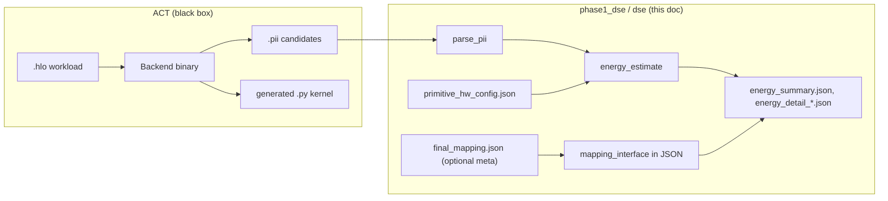

# Hardware interface and static energy (end-to-end)

This document explains how **Phase-1 static energy** fits together with the **hardware-mapping interface** package. Paths are from the **ACT repository root** (`submodule/act` inside MLIR-hardware-analysis).

For container compile runbooks and ISA primitive refresh, see `**ENERGY_ESTIMATION.md`** in this same folder.

---

## 1. Overview




| Black box                                          | You care about                                                                                            | Typical paths (ACT root)                                                              |
| -------------------------------------------------- | --------------------------------------------------------------------------------------------------------- | ------------------------------------------------------------------------------------- |
| **ACT compile**                                    | Valid `**.pii`** per scheduling candidate (plus logs / `asm/`)                                            | Produced under your chosen `--log` directory when running `./backends/<ISA> …`        |
| **Hardware coefficients**                          | `**primitive_hw_config.json`** — per **abstraction class** `energy_per_op_pJ`, `energy_per_byte_pJ`, etc. | `phase1_dse/dse/config/primitive_hw_config.json` (or a fork-specific copy)            |
| **Mapping interface (documentation + provenance)** | CSV/JSON describing **primitive → realization → IP flow → cost tags**; regenerated workbook/JSON          | `phase1_dse/dse/hardware_interface/hardware_mapping_interface_package/`               |
| **Energy CLI**                                     | Reads `**.pii` + hw config**; writes **pJ** totals and per-line breakdown                                 | `python3 -m dse.energy_workload` with `PYTHONPATH` including `phase1_dse` (see below) |


Nothing in this Phase-1 Python path **executes** Rust/OR-Tools or reparses HLO; it only consumes **already materialized** `.pii` text.

---

## 2. How energy is computed

1. **Parse** each `.pii` file into a list of instructions (op name, shapes, line numbers, kernel name metadata).
  - Code: `phase1_dse/dse/src/parse_pii.py`
2. **Feature proxies** per instruction (ops / bytes / “known” flags) using the same helpers as the rest of the DSE package.
  - Code: `phase1_dse/dse/src/features.py` (`_instruction_contrib`, `_extract_width`, …)
3. **Map each PII op name** to one or more **hardware abstraction classes** (e.g. `tensor_compute`, `contiguous_move`, `special_math`) and accumulate
  `energy = ops * energy_per_op_pJ + bytes * energy_per_byte_pJ`  
   using the row for that class in `**primitive_hw_config.json`**.  
  - Code: `phase1_dse/dse/src/energy_estimate.py` (`estimate_instruction_energy`, `estimate_program`)
4. **Write outputs** under `--out`: per-candidate detail JSON, optional CSV, optional bar charts, and a top-level `**energy_summary.json`**.

**Important:** The numeric model is driven by **PII opcode names + `features` + `primitive_hw_config.json`**. It does **not** currently execute the full **primitive_realizations.csv → IP flow** graph from the mapping package line-by-line.

**Optional `final_mapping.json`:** If present (default path below), the CLI loads **metadata only** (version, model id, names of fused patterns) via `load_mapping_meta` and attaches it under `**mapping_interface`** in the summary for **provenance / alignment** with the realization-first story in the docs. It does **not** change the arithmetic unless you extend `energy_estimate.py` to do so.

---

## 3. Hardware-mapping interface package (what each file is)

All under:

`**phase1_dse/dse/hardware_interface/hardware_mapping_interface_package/`**


| Path                             | Role                                                                                                                                                                                                                      |
| -------------------------------- | ------------------------------------------------------------------------------------------------------------------------------------------------------------------------------------------------------------------------- |
| `**README.md`**                  | Human description of the **realization-first** schema (primitive → realization → IP → cost tag), fusion rules, and how to regenerate artefacts.                                                                           |
| `**primitive_realizations.csv`** | Each TAIDL-style **primitive** and its possible **realizations** (default vs conditional).                                                                                                                                |
| `**realization_ip_flow.csv`**    | Ordered **IP block** steps per realization (read/write/compute/…).                                                                                                                                                        |
| `**realization_cost_tags.csv`**  | **Cost accounting tags** and formula hints per realization.                                                                                                                                                               |
| `**fused_patterns.json`**        | **Fusion overrides**: multi-primitive sequences (e.g. softmax decomposition) collapsed into one named pattern with its own realization / IP / cost tag.                                                                   |
| `**generate_final_mapping.py`**  | **Regenerator script**: reads the three CSVs + `fused_patterns.json`, writes `**final_mapping.xlsx`** and `**final_mapping.json`** (requires **openpyxl**). Run from this directory: `python3 generate_final_mapping.py`. |
| `**final_mapping.json`**         | **Machine-readable** rollup (generated; checked in for convenience). Default path read by `load_mapping_meta` when `--mapping_json` is omitted.                                                                           |
| `**final_mapping.xlsx`**         | **Human-readable** multi-sheet workbook (generated).                                                                                                                                                                      |
| `**explorer.html`**              | Static **TAIDL Realization Explorer** (see below).                                                                                                                                                                        |


### Realization-first vocabulary

The mapping package is organized around **realizations**, not a single fixed “opcode = one block” table:

- **Primitive** — A TAIDL-level semantic op (e.g. `broadcast`, `dot`, `exponential`). These are the names you reason about in the compiler / ISA lowering story.
- **Realization** — A concrete **how** that primitive can execute on a target (e.g. Gemmini): same primitive, different hardware stories (virtual vs materialized broadcast, logical reshape vs physical relayout). Each realization has a stable `**realization_id`**.
- **Default realization** — The row marked default in `primitive_realizations.csv` when no more specific condition applies.
- **IP flow** — An ordered list of **IP blocks** (DMA, systolic mesh, ACC ports, Rocket, etc.) and **direction** (read / write / compute / control / absorbed / metadata) for that realization. Lives in `realization_ip_flow.csv` (and is rolled into `final_mapping.json` / `.xlsx`).
- **Cost tag** — An accounting bucket attached to a realization (`tensor_compute`, `onchip_movement`, `host_fallback`, …) with an optional **formula hint** in `realization_cost_tags.csv`. These tags are meant to line up with high-level cost thinking (and loosely with rows in `primitive_hw_config.json`), not to be executed as code by the Phase-1 `.pii` estimator today.
- **Fused pattern** — A named sequence of primitives (e.g. `exponential` + `reduce_add` + `broadcast` + `divide`) that the interface treats as **one** fused region with its own IP flow and cost tag (`fused_patterns.json`). Higher **priority** patterns are considered first; primitives consumed by a match are not also charged separately under naive per-op fallback in a *full* mapping-driven cost engine (the bundled `.pii` static tool uses a simpler opcode → abstraction-class path; see §2).

### Example: one primitive — `broadcast`

The CSV `primitive_realizations.csv` lists three realizations for `**broadcast`** (abbreviated here; see the file for full text):


| realization_id           | default? | Idea                                                                                                            |
| ------------------------ | -------- | --------------------------------------------------------------------------------------------------------------- |
| `virtual_broadcast`      | yes      | Single consumer, immediately consumed: **no dense materialization** — controller / stride reuse.                |
| `materialized_broadcast` | no       | The expanded tensor **must exist** in scratchpad (or similar): DMA read/write cost like real bytes.             |
| `fused_broadcast`        | no       | **Absorbed** inside a fused pattern (e.g. softmax): no standalone broadcast charge; the fusion owns accounting. |


So “broadcast” is not one cost; **which realization applies** depends on schedule and fusion context. `realization_ip_flow.csv` spells out the IP steps per `realization_id`; `realization_cost_tags.csv` ties each to a **cost tag** and formula skeleton. `generate_final_mapping.py` merges all of that into `**final_mapping.json`** for tools and spreadsheets.

### TAIDL Realization Explorer — `explorer.html`

**What it is:** A **single-file static web UI** (“TAIDL Realization Explorer”) shipped next to the CSV/JSON. It presents the same conceptual model: sidebar by category (Compute / Layout / Data / Meta), pick a **primitive**, then browse each **realization** (condition, cost tag, formula hint, **IP pipeline** diagram, default badge). It also lists **fused patterns** that mention the selected primitive (e.g. `softmax_fused` for `broadcast`).

---

## 4. Phase-1 DSE Python modules (paths and duties)

Paths relative to ACT root.


| Path                                                 | What it does                                                                                                                      |
| ---------------------------------------------------- | --------------------------------------------------------------------------------------------------------------------------------- |
| `**phase1_dse/dse/energy_workload.py`**              | Thin entry: `python -m dse.energy_workload` → calls `main()` in `dse.src.energy_workload`.                                        |
| `**phase1_dse/dse/src/energy_workload.py**`          | CLI (`--input`, `--hw_config`, `--out`, `--mapping_json`, `--plot`); loops candidates; writes summary/detail/CSV; optional plots. |
| `**phase1_dse/dse/src/energy_estimate.py**`          | Loads abstraction classes from JSON; `**estimate_program**`; `**load_mapping_meta**` for optional `final_mapping.json`.           |
| `**phase1_dse/dse/src/parse_pii.py**`                | Parses `.pii` files / directories into program objects.                                                                           |
| `**phase1_dse/dse/src/features.py**`                 | Instruction-level op/byte proxies used by the estimator (and related DSE code).                                                   |
| `**phase1_dse/dse/src/plot.py**`                     | Optional `**--plot**`: energy-by-abstraction-class bar chart.                                                                     |
| `**phase1_dse/dse/config/primitive_hw_config.json**` | **Source of energy coefficients** (and related knobs) keyed by abstraction class name.                                            |


**Example inputs** (for smoke tests):

- `**phase1_dse/dse/examples/qkv_like.pii`** (and siblings under `examples/`)

**Typical invocation** (from ACT root, with `phase1_dse` on `PYTHONPATH`):

```bash
export PYTHONPATH="phase1_dse:${PYTHONPATH}"
python3 -m dse.energy_workload \
  --input phase1_dse/dse/examples/qkv_like.pii \
  --hw_config phase1_dse/dse/config/primitive_hw_config.json \
  --out phase1_dse/dse/output/my_energy_run \
  --mapping_json phase1_dse/dse/hardware_interface/hardware_mapping_interface_package/final_mapping.json
```

Omit `--mapping_json` to use the same default file path baked into `energy_estimate._DEFAULT_MAPPING`.

---

## 5. Related scripts outside `phase1_dse`

These live under `**scripts/bash/**` on the ACT tree. They feed **ISA-level** `taidl_instruction_costs.json` and plots, **not** the `.pii` abstraction-class estimator above, but they use the **same** `primitive_hw_config.json` family when you set `HW_RESOURCE_CONFIG`.


| Path                                                 | Role                                                                                                                                                                                      |
| ---------------------------------------------------- | ----------------------------------------------------------------------------------------------------------------------------------------------------------------------------------------- |
| `**scripts/bash/run_isa_primitives.sh`**             | Regenerate TAIDL backend artifacts (unless `SKIP_REGEN=1`), export primitive CSVs, run `**estimate_primitive_resources.py`** → per-instruction JSON for `**plot_isa_workload_costs.py`**. |
| `**scripts/bash/run_gemmini_17_primitives.sh**` etc. | Thin wrappers calling `run_isa_primitives.sh`.                                                                                                                                            |
| `**scripts/bash/docker_verify_energy_path.sh**`      | Runs `**dse.energy_workload**` inside the container to validate the static-energy path.                                                                                                   |


Archived HLO/PT2HLO demo drivers: `**scripts/bash/archive/**` (see `scripts/bash/README.md`).

---

